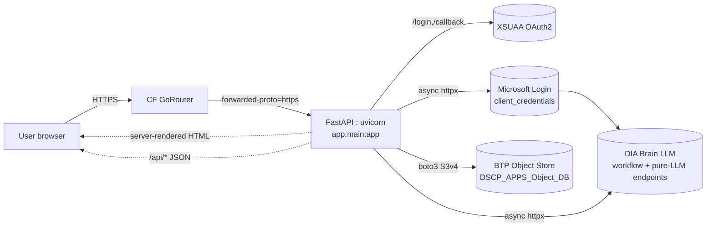
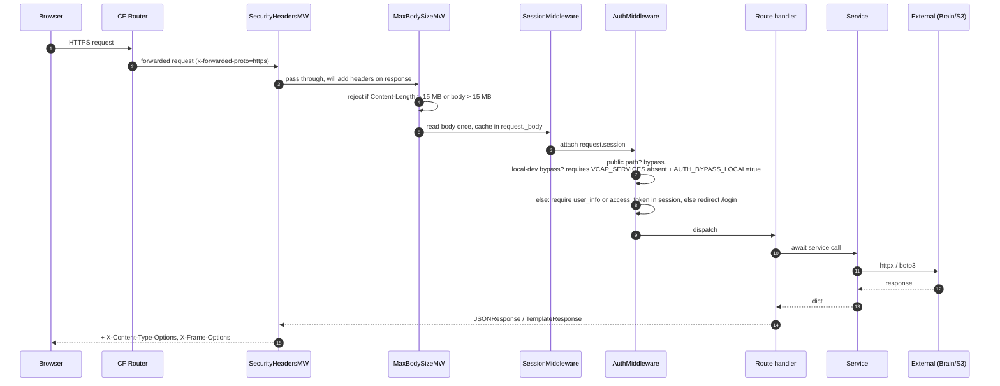

# 01 — Architecture (the ULTRA PLAN)

> "Plan it, ultra-plan it, then ultra-think it." This page is the unified mental model.

---

## 1. The big picture

DSCP_AI is a **server-rendered FastAPI monolith** that hosts a *suite* of AI productivity apps for the BSH Digital Supply Chain Planning org. There is **no SPA** and **no separate API gateway**. One Python process serves HTML, static assets and JSON APIs, sitting behind SAP BTP's OAuth2 (XSUAA) and using two BTP-bound services: **XSUAA** for identity and **Object Store** (S3-compatible) for persistence.



---

## 2. Layered architecture

```
┌──────────────────────────────────────────────────────────────────┐
│  Presentation (Jinja templates + static CSS/JS)                  │
│   app/templates/*.html · app/static/css · app/static/js          │
├──────────────────────────────────────────────────────────────────┤
│  HTTP layer (FastAPI routers)                                    │
│   app/routers/pages.py  (HTML)  ·  app/routers/api/  (JSON)     │
├──────────────────────────────────────────────────────────────────┤
│  Middleware stack                                                │
│   SecurityHeaders → MaxBodySize → Session → Auth → Route         │
├──────────────────────────────────────────────────────────────────┤
│  Services (business logic, async)                                │
│   feature_service.py × 9   +   common_service.py (Brain helpers) │
├──────────────────────────────────────────────────────────────────┤
│  Persistence & infra                                             │
│   History/  (storage_service · common_history · analytics ·      │
│   feedback · favorites · user_id_utils · per-feature history)    │
├──────────────────────────────────────────────────────────────────┤
│  External systems                                                │
│   XSUAA · Microsoft AAD · DIA Brain · BTP Object Store           │
└──────────────────────────────────────────────────────────────────┘
```

Rules of the road:

* **Routers never call boto3 or httpx.** They orchestrate services.
* **Services are async** and use `httpx.AsyncClient` with `verify=get_ssl_context()`.
* **History services** never call Brain. They are pure CRUD over the Object Store.
* **`common_service.py`** is the only file that knows how to construct Brain payloads.

---

## 3. Request lifecycle



Middleware are added in `app/main.py` in **reverse order of execution**:

```python
app.add_middleware(AuthMiddleware)            # innermost
app.add_middleware(SessionMiddleware, ...)
app.add_middleware(MaxBodySizeMiddleware)
app.add_middleware(SecurityHeadersMiddleware) # outermost
```

So a real request is processed: `SecurityHeaders → MaxBody → Session → Auth → Route`, and the response unwinds in reverse.

---

## 4. The 9 apps in one frame

| App | Page route | Primary API | Service | Brain ID env | Persists history? |
|---|---|---|---|---|---|
| BPMN Builder | `/signavio-bpmn` | `/api/bpmn/*`, `/api/generate-bpmn` | `signavio_service.py` | `SIGNAVIO_BRAIN_ID` | yes (`bpmn-history`) |
| Audit Check | `/audit-check` | `/api/audit-doc-check`, `/api/audit-chat` | `audit_service.py` | `AUDIT_CHECK_BRAIN_ID` | no |
| BPMN Checker | `/bpmn-checker` | `/api/bpmn-diagram-check` | `bpmn_checker_service.py` | `BPMN_CHECKER_BRAIN_ID` | no |
| Spec Builder | `/spec-builder` | `/api/export-functional-spec`, `/api/export-business-requirement`, `/api/export-fs-variant` | `fs_br_document_service.py` | (none — pure docx) | no |
| PPT Creator | `/ppt-creator` | `/api/ppt/*` | `ppt_creator_service.py` | `PPT_BRAIN_ID` | yes (`ppt-history`) |
| Diagram Generator | `/diagram-generator` | `/api/diagram/*` | `diagram_generator_service.py` | `DIAGRAM_BRAIN_ID` | yes (`diagram-history`) |
| Docupedia Publisher | `/docupedia-publisher` | `/api/confluence-builder/*` | `confluence_builder_service.py` | `DOCUPEDIA_BRAIN_ID` | no (publishes to Confluence) |
| One Pager Creator | `/one-pager-creator` | `/api/one-pager/*` | `one_pager_creator_service.py` | `ONE_PAGER_BRAIN_ID` | yes (`one-pager-history`) |
| Signavio Learning | `/signavio-learning` | (redirect only) | external GH Pages | – | – |
| Admin | `/dscpadmin` | `/api/admin/analytics`, `/api/admin/feedback` | `analytics_service.py`, `feedback_service.py` | – | reads only |

See [03-apps-catalog.md](03-apps-catalog.md) for the full app dossier.

---

## 5. Two HTTP "personalities" of the app

The app exposes **two contracts** from one process:

### 5.1 HTML pages (server-rendered)
* Defined in [app/routers/pages.py](../app/routers/pages.py).
* Each route does three things:
  1. `user_info = get_current_user(request)` (raises 401 if unauth in prod).
  2. `asyncio.create_task(track_click(app_key, user_id))` (fire-and-forget analytics).
  3. `_render_template(...)` — wraps `TemplateResponse` for both new/old Starlette signatures.
* Templates extend [base.html](../app/templates/base.html). The base layer injects `window.APP_CONFIG` so the JS layer knows app env, log level, brain portal URL, css version, and changelog.

### 5.2 JSON & file APIs (`/api/*`)
* Defined in the [app/routers/api/](../app/routers/api/) package — one module per feature, aggregated by `api/__init__.py`.
* Pydantic models on every body input (`Field(max_length=…)` everywhere).
* File uploads go through `_validate_magic` for PDF/PNG/JPG signatures and a 10 MB cap.
* Errors return `JSONResponse` with `{status, message, detail}`. Internals (`str(e)`) are **never** exposed.

---

## 6. The DIA Brain integration shape

Every AI feature follows the same recipe:

```python
# 1. ensure a Brain ID is configured
brain_id = os.getenv("SIGNAVIO_BRAIN_ID")

# 2. (optional) create a chat history once → server-side context
chat = await create_chat_history(brain_id)
chat_history_id = chat["chatHistoryId"]

# 3. (optional) upload attachments → returns IDs you reuse later
upload = await upload_attachments(brain_id, [upload_file])
attachment_ids = upload["attachmentIds"]

# 4. invoke the brain
result = await call_brain_workflow_chat(    # or call_brain_pure_llm_chat
    brain_id,
    prompt=build_prompt(...),
    chat_history_id=chat_history_id,
    attachment_ids=attachment_ids,
    custom_behaviour="…",
    workflow_id="BW10nzxLhlqO",
)

# 5. parse result["result"] (sometimes JSON, sometimes XML, sometimes markdown)
```

The two Brain endpoints used:

| Helper | URL | When to use |
|---|---|---|
| `call_brain_workflow_chat` | `POST /chat/workflow` | Feature with a configured "Workflow" in DIA Brain (e.g. BPMN, PPT) |
| `call_brain_pure_llm_chat` | `POST /chat/pure-llm` | Pure LLM completion, no RAG retrieval (Confluence drafts) |

Auth tokens come from Microsoft AAD (`brain_auth.py`):

```python
POST https://login.microsoftonline.com/{BRAIN_TENANT_ID}/oauth2/v2.0/token
  grant_type=client_credentials
  scope=api://dia-brain/.default
```

Tokens are 2-hour Bearer tokens, fetched fresh per request (no in-memory cache; trivial cost for this throughput).

---

## 7. Persistence model (Object Store)

We do **not** use a relational DB. All persisted data is JSON in S3.

```
analytics/
  clicks/{YYYY-MM-DD}.json          {app_key: int}
  users/{YYYY-MM-DD}.json           {app_key: [user_id, …]}
  users_total.json                  {app_key: [user_id, …]}
  gen_daily/{YYYY-MM-DD}.json       {app_key: int}
  gen_failed/{YYYY-MM-DD}.json      {app_key: int}
  generations.json                  {app_key: int}    (all-time)
  gen_failed_total.json             {app_key: int}
  downloads/{YYYY-MM-DD}.json       {app_key: int}
  downloads_total.json              {app_key: int}

{prefix}-history/{safe_user_id}/
  index.json                                  list[entry]  (newest first, max 50)
  {gen_id}/content.json                       full payload (slides / xml / html)

favorites/{safe_user_id}.json                 ["ppt", "diagram", …]
feedback/{app_key}/{feedback_id}.json         single rating record
feedback/aggregate/{app_key}.json             rolling counts {1..4}
```

* **`safe_user_id`** = lowercase regex-sanitised, 64 chars max — protects S3 key safety.
* **`gen_id`** = UUID4. Validated by regex on every API entry.
* **Reads/writes are async** via `asyncio.to_thread` wrapping boto3.
* **Best-effort**: tracking calls are wrapped in `try/except` and never raise.

Full layout in [06-storage-and-history.md](06-storage-and-history.md).

---

## 8. Security boundary summary

| Threat | Mitigation | File |
|---|---|---|
| Unauthenticated access | `AuthMiddleware` redirects to `/login`; bypass requires *both* `AUTH_BYPASS_LOCAL=true` AND missing `VCAP_SERVICES` | [app/main.py](../app/main.py) |
| OAuth CSRF | `state` token via `secrets.token_urlsafe(32)`, compared with `secrets.compare_digest` | [app/main.py](../app/main.py) |
| Body DoS | `MaxBodySizeMiddleware` 15 MB hard cap | [app/main.py](../app/main.py) |
| Upload spoofing | `_validate_magic()` checks PDF/PNG/JPEG headers + 10 MB cap | [app/routers/api/_shared.py](../app/routers/api/_shared.py) |
| SSRF (Confluence) | `_validate_confluence_url()` enforces HTTPS + host allowlist | [app/services/confluence_builder_service.py](../app/services/confluence_builder_service.py) |
| Path traversal in S3 keys | `_validate_key()` blocks `..` and absolute keys | [app/services/History/storage_service.py](../app/services/History/storage_service.py) |
| Prompt injection from filenames | `sanitize_filename_for_prompt()` | [app/services/common_service.py](../app/services/common_service.py) |
| Cookie overflow | Only `user_info` (name/email/scopes) goes into the session cookie, never the JWT | [app/main.py](../app/main.py) |
| TLS verification | `get_ssl_context()` returns `True` or a custom CA in prod, never disables | [app/core/config.py](../app/core/config.py) |
| Sensitive logs | `logger.exception()` server-side, generic messages to client | every router/service |
| Clickjacking / sniffing | `X-Frame-Options: SAMEORIGIN`, `X-Content-Type-Options: nosniff` | `SecurityHeadersMiddleware` |

Deep dive in [04-auth-and-security.md](04-auth-and-security.md).

---

## 9. Configuration model

Three sources, in precedence order:

1. **CF environment** (set via `cf set-env` or BTP Cockpit).
2. **Bound services** (`VCAP_SERVICES` JSON injected by the platform).
3. **`.env` files** loaded early by `app/main.py` (root then `app/.env`) — local dev only.

The most important categories:

| Group | Vars |
|---|---|
| Brain | `BRAIN_TENANT_ID`, `BRAIN_CLIENT_ID`, `BRAIN_CLIENT_SECRET`, `BRAIN_API_BASE_URL`, `BRAIN_PORTAL_URL` |
| Brain feature IDs | `SIGNAVIO_BRAIN_ID`, `AUDIT_CHECK_BRAIN_ID`, `BPMN_CHECKER_BRAIN_ID`, `PPT_BRAIN_ID`, `DIAGRAM_BRAIN_ID`, `ONE_PAGER_BRAIN_ID`, `DOCUPEDIA_BRAIN_ID` |
| Workflow IDs | `SIGNAVIO_WORKFLOW_ID`, … |
| Sessions | `SESSION_SECRET` (required in prod) |
| Object Store (local fallback) | `OBJECT_STORE_HOST`, `OBJECT_STORE_BUCKET`, `OBJECT_STORE_ACCESS_KEY_ID`, `OBJECT_STORE_SECRET_ACCESS_KEY`, `OBJECT_STORE_REGION` |
| TLS | `SSL_VERIFY`, `SSL_CA_BUNDLE` |
| Behaviour | `ENVIRONMENT`, `AUTH_BYPASS_LOCAL`, `CLIENT_LOGGING_ENABLED`, `CLIENT_LOG_LEVEL`, `CONFLUENCE_ALLOWED_HOSTS` |

In production, **proxy env vars are stripped** (`HTTP_PROXY`, …) so DNS works on BTP. Done at the very top of `app/main.py`.

Full reference in [09-deployment.md](09-deployment.md).

---

## 10. Why this shape?

* **Monolith over microservices** — small team, ~10 K LOC, deployment is a single CF push.
* **Server-rendered Jinja over SPA** — every page is independent, SEO is irrelevant inside corporate, and "no JS framework" lowers the barrier to contribution.
* **Object Store over relational DB** — history is per-user JSON; we don't need joins or transactions.
* **Best-effort analytics** — never block a user request because a counter file failed to write.
* **One Brain helper module** — keeps the auth, retry, error-mapping logic in one place; feature services stay thin.

That's the system. Now read [02-onboarding.md](02-onboarding.md) to actually run it.
