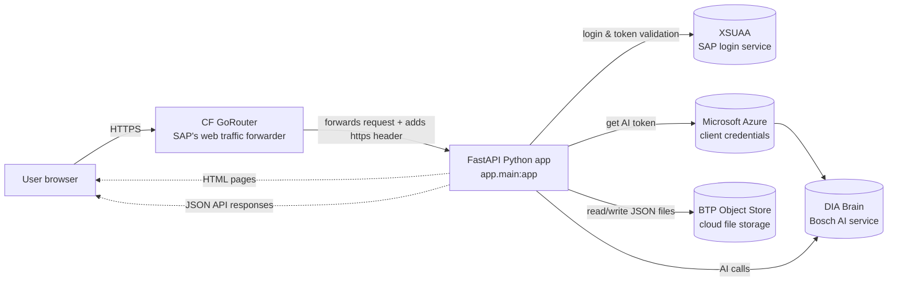
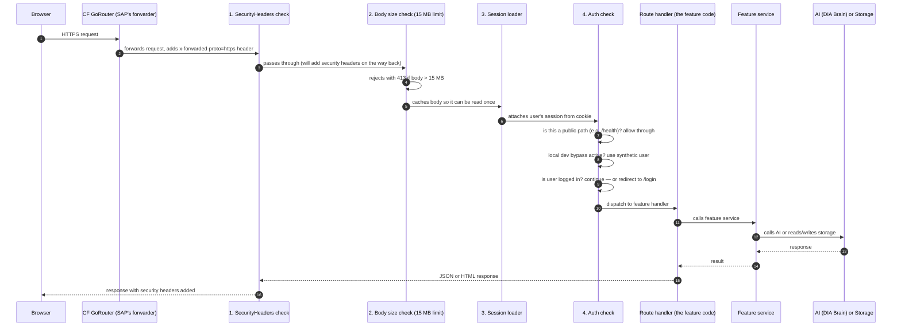

# 01 — Architecture Overview

> This page explains how DSCP_AI is built — think of it as a map of the whole system.

---

## Key terms used throughout all docs

Before diving in, here are the most common technical terms you will see:

| Term | Plain-English meaning |
|---|---|
| **Cloud Foundry (CF)** | SAP's cloud hosting platform. The app runs here in production. Think of it as "the server in SAP's cloud." |
| **CF GoRouter** | Cloud Foundry's built-in web traffic forwarder. It sits between the user's browser and the Python app, receiving HTTPS requests and passing them on. |
| **BTP** | SAP Business Technology Platform — the larger SAP cloud that contains Cloud Foundry. |
| **XSUAA** | SAP's login service (stands for "eXtended Services for User Account and Authentication"). It verifies who you are using your corporate Bosch account. |
| **VCAP_SERVICES** | A JSON variable that Cloud Foundry automatically injects into the app, containing credentials (URLs, passwords) for every cloud service it is connected to. Only present when running on Cloud Foundry — not on your laptop. |
| **Object Store** | Cloud file storage (similar to Amazon S3) where the app saves history, analytics, and feedback as JSON files. |
| **DIA Brain** | Bosch's internal AI service. Every AI feature in the app calls this. |
| **Middleware** | Code that runs automatically before every request is handled — like a security checkpoint pipeline. |
| **JWT** | JSON Web Token — a compact login token issued by XSUAA. Contains the user's identity and permissions. |
| **Pydantic** | A Python library that checks incoming data is valid (right type, not too long, etc.) before processing it. |
| **Jinja** | The HTML template engine used to build pages. Python variables are inserted into HTML template files. |
| **boto3** | Amazon's Python library for S3-compatible file storage. Used to read/write the BTP Object Store. |
| **UUID** | Universally Unique Identifier — a random ID that is virtually guaranteed to be unique. Used to identify saved items. |

---

## 1. The big picture

DSCP_AI is a **single Python web server** that hosts a suite of AI productivity tools for the BSH Digital Supply Chain Planning team.

- **No separate frontend app** — pages are built server-side and sent as complete HTML
- **No separate API gateway** — one process handles both HTML pages and JSON API calls
- **Runs on SAP BTP Cloud Foundry** in production (Cloud Foundry = SAP's cloud hosting platform)
- **Uses two cloud services**: XSUAA for login, and Object Store for saving data



---

## 2. How the code is layered

Think of the code as layers from "what the user sees" down to "infrastructure":

```
┌──────────────────────────────────────────────────────────────────┐
│  Presentation (what users see)                                   │
│   HTML templates in app/templates/                               │
│   CSS in app/static/css/  ·  JS in app/static/js/               │
├──────────────────────────────────────────────────────────────────┤
│  HTTP layer (handles incoming requests)                          │
│   app/routers/pages.py  ← HTML page routes                       │
│   app/routers/api/      ← JSON API routes                        │
├──────────────────────────────────────────────────────────────────┤
│  Middleware (runs automatically before every request)            │
│   SecurityHeaders → MaxBodySize → Session → Auth → Route         │
├──────────────────────────────────────────────────────────────────┤
│  Services (the actual feature logic, all async)                  │
│   One service file per feature + common_service.py for AI calls  │
├──────────────────────────────────────────────────────────────────┤
│  Persistence (saves and loads data)                              │
│   app/services/History/ — per-feature history + analytics        │
├──────────────────────────────────────────────────────────────────┤
│  External services                                               │
│   XSUAA (login) · Microsoft Azure (AI auth) · DIA Brain (AI)    │
│   BTP Object Store (file storage)                                │
└──────────────────────────────────────────────────────────────────┘
```

**The rules:**
* **Routes call services.** Services call the AI or storage. Routes never directly touch storage.
* **Services are async** — they don't block while waiting for network responses.
* **History services** only save/load data. They never call the AI.
* **`common_service.py`** is the only file that builds requests to DIA Brain.

---

## 3. What happens when a request comes in

Here is the step-by-step journey of every request:



**Why middleware is added in reverse order in the code:**

```python
app.add_middleware(AuthMiddleware)            # innermost — runs last before the route
app.add_middleware(SessionMiddleware, ...)
app.add_middleware(MaxBodySizeMiddleware)
app.add_middleware(SecurityHeadersMiddleware) # outermost — runs first on requests
```

FastAPI/Starlette stacks middleware: last added = outermost = first to run on incoming requests, last on responses. So `SecurityHeaders` is first to see the request and last to touch the response (adding the headers).

---

## 4. The 9 apps at a glance

| App | Page URL | Service file | Saves history? |
|---|---|---|---|
| BPMN Builder | `/signavio-bpmn` | `signavio_service.py` | Yes |
| Audit Check | `/audit-check` | `audit_service.py` | No |
| BPMN Checker | `/bpmn-checker` | `bpmn_checker_service.py` | No |
| Spec Builder | `/spec-builder` | `fs_br_document_service.py` | No (streams a .docx file) |
| PPT Creator | `/ppt-creator` | `ppt_creator_service.py` | Yes |
| Diagram Generator | `/diagram-generator` | `diagram_generator_service.py` | Yes |
| Docupedia Publisher | `/docupedia-publisher` | `confluence_builder_service.py` | No (publishes to Confluence) |
| One Pager Creator | `/one-pager-creator` | `one_pager_creator_service.py` | Yes |
| Signavio Learning | `/signavio-learning` | External GitHub Pages (redirect) | No |
| Admin Dashboard | `/dscpadmin` | `analytics_service.py`, `feedback_service.py` | Reads only |

See [03-apps-catalog.md](03-apps-catalog.md) for full details on each app.

---

## 5. Two types of responses

The app serves two types of content from the same Python process:

### 5.1 HTML pages (what you see in the browser)
Defined in [app/routers/pages.py](../app/routers/pages.py). Every page route does exactly three things:
1. Looks up who the logged-in user is
2. Fires a "page visit" analytics counter in the background (doesn't slow down the page load)
3. Returns a rendered HTML page using Jinja templates (Python variables inserted into .html files)

Templates extend [base.html](../app/templates/base.html). The base template injects `window.APP_CONFIG` so the page's JavaScript knows the environment, log level, brain portal URL, CSS version, and changelog.

### 5.2 JSON API responses (`/api/*`)
Defined in [app/routers/api/](../app/routers/api/) — one module per feature. These:
* Validate all input data using Pydantic (type checks, length limits)
* Check uploaded files are real PDFs/PNGs/JPGs by reading the first few bytes (magic bytes), not just the filename
* Always return errors as JSON with a user-friendly message — internal error details (`str(e)`) are **never** sent to the browser

---

## 6. How the AI (DIA Brain) integration works

Every AI feature follows the same four-step recipe:

```python
# Step 1: create a "chat session" so the AI can remember context across turns
brain_id = os.getenv("SIGNAVIO_BRAIN_ID")
chat = await create_chat_history(brain_id)
chat_history_id = chat["chatHistoryId"]

# Step 2: (optional) upload files — the AI can then read them
upload = await upload_attachments(brain_id, [upload_file])
attachment_ids = upload["attachmentIds"]

# Step 3: send a prompt and get back the AI result
result = await call_brain_workflow_chat(
    brain_id,
    prompt=build_prompt(...),
    chat_history_id=chat_history_id,
    attachment_ids=attachment_ids,
    workflow_id="BW10nzxLhlqO",
)

# Step 4: parse the result (sometimes JSON, sometimes XML, sometimes plain text)
```

**Two types of Brain calls:**

| Helper | When to use |
|---|---|
| `call_brain_workflow_chat` | Uses a pre-configured AI pipeline in DIA Brain (RAG retrieval, tools, etc.). Used by most features (BPMN, PPT, Diagrams). |
| `call_brain_pure_llm_chat` | Simple free-form prompt, no pipeline. Used by Docupedia Publisher. |

> **RAG (Retrieval-Augmented Generation):** A technique where the AI retrieves relevant documents from a knowledge base before answering. The Brain workflow handles this automatically.

**Authentication to the AI:** Uses Microsoft Azure credentials (client ID + client secret) to obtain a Bearer token valid for 2 hours. A new token is fetched per request — this is cheap at the current usage level.

---

## 7. How data is saved (no database)

There is **no relational database**. All saved data is JSON files in the Object Store (cloud file storage, similar to Amazon S3).

```
Object Store bucket ("DSCP_APPS_Object_DB")
│
├── analytics/
│   ├── clicks/{YYYY-MM-DD}.json    ← how many times each app was opened each day
│   ├── users/{YYYY-MM-DD}.json     ← which users opened each app each day
│   ├── generations.json            ← all-time AI generation counts per app
│   └── downloads/{date}.json       ← download counts
│
├── ppt-history/{user}/             ← each user's saved PPT generations
│   ├── index.json                  ← list of items (newest first, max 50)
│   └── {gen_id}/content.json       ← full saved content for one item
│
├── diagram-history/{user}/...
├── bpmn-history/{user}/...
├── one-pager-history/{user}/...
│
├── favorites/{user}.json           ← starred apps per user
└── feedback/{app}/{id}.json        ← user ratings
```

* **`safe_user_id`** = the user's ID with special characters removed (max 64 chars). Keeps file paths safe.
* **`gen_id`** = UUID (randomly generated unique ID). Validated by regex on every API entry.
* **Reads/writes are async** — they don't block the request while waiting for storage.
* **Best-effort**: counter writes are wrapped in try/except and never fail the user's actual request.

Full layout in [06-storage-and-history.md](06-storage-and-history.md).

---

## 8. Security — plain-English summary

| Threat | How it's stopped | Where in code |
|---|---|---|
| **Unauthorised access** | Every page requires login. Only a small list of paths (login page, health check, static files) are public. | [app/main.py](../app/main.py) |
| **Login hijacking (CSRF)** | When login starts, a random 32-character secret is created and stored in the session. On the callback, it must match. Attackers cannot forge this. | [app/main.py](../app/main.py) |
| **Giant request attacks (DoS)** | Requests bigger than 15 MB are rejected before any processing. | [app/main.py](../app/main.py) |
| **Fake file uploads** | Files are checked by their first few bytes ("magic bytes") — a real PDF always starts with `%PDF-`. Renaming a .exe to .pdf doesn't fool this check. | [app/routers/api/_shared.py](../app/routers/api/_shared.py) |
| **Tricking the server to call bad URLs (SSRF)** | The Confluence URL is checked against an approved hostname list before any outgoing request. SSRF = Server-Side Request Forgery. | [app/services/confluence_builder_service.py](../app/services/confluence_builder_service.py) |
| **Folder tricks in file storage (path traversal)** | Storage paths containing `..` or starting with `/` are rejected. | [app/services/History/storage_service.py](../app/services/History/storage_service.py) |
| **Commands injected via filenames into AI prompts** | Filenames are cleaned before being included in any AI prompt. | [app/services/common_service.py](../app/services/common_service.py) |
| **Cookie too large / overflow** | Only a small user info dict goes into the session cookie, never the full JWT login token (which can be kilobytes). | [app/main.py](../app/main.py) |
| **Insecure connections** | TLS verification is always on in production. It can only be turned off locally and only when `ENVIRONMENT` is not `prod`. | [app/core/config.py](../app/core/config.py) |
| **Leaking error details** | All exception details are logged on the server. The browser only receives a generic "try again" message. | every router/service |
| **Clickjacking / content sniffing** | `X-Frame-Options: SAMEORIGIN` and `X-Content-Type-Options: nosniff` headers are added to every response. | `SecurityHeadersMiddleware` |

Deep dive in [04-auth-and-security.md](04-auth-and-security.md).

---

## 9. Configuration

Settings come from three places, in order of priority (higher = wins):

1. **CF environment variables** — set via `cf set-env` command or the BTP Cockpit web UI.
2. **VCAP_SERVICES** — automatically injected by Cloud Foundry with credentials for bound services (XSUAA, Object Store).
3. **`.env` files** — only loaded on your local machine for development.

| Group | Variables |
|---|---|
| AI authentication | `BRAIN_TENANT_ID`, `BRAIN_CLIENT_ID`, `BRAIN_CLIENT_SECRET`, `BRAIN_API_BASE_URL`, `BRAIN_PORTAL_URL` |
| AI feature IDs (one per app) | `SIGNAVIO_BRAIN_ID`, `PPT_BRAIN_ID`, `DIAGRAM_BRAIN_ID`, `ONE_PAGER_BRAIN_ID`, `DOCUPEDIA_BRAIN_ID`, etc. |
| Session security | `SESSION_SECRET` — required in production; app refuses to start without it |
| Storage (local dev only) | `OBJECT_STORE_HOST`, `OBJECT_STORE_BUCKET`, `OBJECT_STORE_ACCESS_KEY_ID`, `OBJECT_STORE_SECRET_ACCESS_KEY`, `OBJECT_STORE_REGION` |
| TLS / SSL | `SSL_VERIFY` (always true in prod), `SSL_CA_BUNDLE` (path to custom CA certificate) |
| Behaviour flags | `ENVIRONMENT`, `AUTH_BYPASS_LOCAL`, `CLIENT_LOGGING_ENABLED`, `CONFLUENCE_ALLOWED_HOSTS` |

> In production, corporate proxy environment variables (`HTTP_PROXY`, `HTTPS_PROXY`, etc.) are automatically removed at startup so that SAP BTP's own DNS works correctly.

Full reference in [09-deployment.md](09-deployment.md).

---

## 10. Why was it built this way?

| Decision | Reason |
|---|---|
| **One server instead of microservices** | Small team, ~10K lines of code. One `cf push` deploys everything. No inter-service networking to manage. |
| **Server-rendered HTML instead of a React/Vue/Angular SPA** | Each page is self-contained. No JavaScript framework to learn or maintain. Easier for new contributors. |
| **File storage instead of a relational database** | History is per-user JSON blobs. No joins or transactions needed. Simpler to run and cheaper. |
| **Best-effort analytics** | Analytics counters are fire-and-forget. If a counter write fails, the user's actual request is never delayed or broken. |
| **One AI helper module (`common_service.py`)** | All Brain authentication, retry logic, and error handling in one place. Feature services stay thin and focused. |

Next: read [02-onboarding.md](02-onboarding.md) to set up your local development environment.
