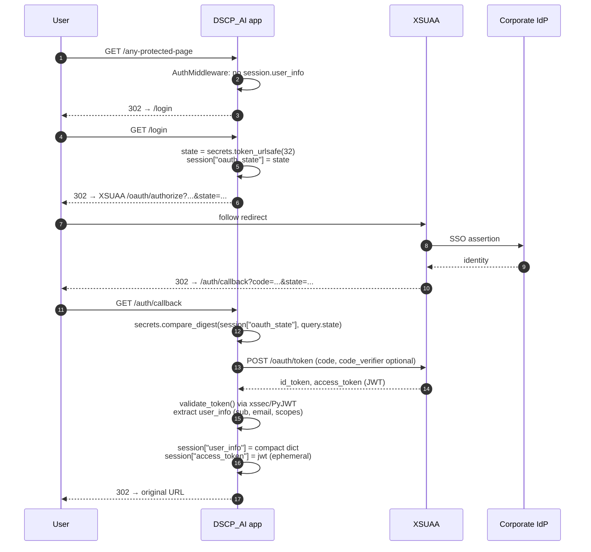

# 04 — Auth & Security

This document is the canonical reference for **how login works** and **what protects the app**.

---

## 1. Identity provider: SAP XSUAA

XSUAA (eXtended Services for User Account & Authentication) is SAP BTP's UAA-based OAuth2 service. In production, the app is bound to an XSUAA instance named **`bsh_dscp_ai_apps`**, configured by [xs-security.json](../xs-security.json):

```jsonc
{
  "xsappname": "bsh_dscp_ai_apps",
  "tenant-mode": "dedicated",
  "scopes": [
    {"name": "$XSAPPNAME.Display"},
    {"name": "$XSAPPNAME.Admin"}
  ],
  "role-templates": [
    {"name": "BT109D1_UD_DSCP_Apps_Viewer", "scope-references": ["$XSAPPNAME.Display"]},
    {"name": "BT109D1_UD_DSCP_Apps_Admin",  "scope-references": ["$XSAPPNAME.Admin"]}
  ]
}
```

Provisioning is performed once via `scripts/provision-xsuaa.ps1` (or the BTP Cockpit). End users land in role collections that reference these templates — *Viewer* allows access; *Admin* unlocks `/dscpadmin` (also gated by the Python-side `ADMIN_USERS` allowlist).

---

## 2. The OAuth2 dance



* The `state` token prevents CSRF on the redirect step. We compare with `secrets.compare_digest` (constant-time).
* The `code` exchange happens **server-side**, never in the browser.
* The full JWT is **not** stored in the session cookie — only a compact `user_info` dict (display name, email, scopes). This avoids cookies > 4 KB which Cloudflare/intermediaries may strip.

---

## 3. Local development bypass

```python
def _is_auth_bypassed():
    return (
        os.getenv("AUTH_BYPASS_LOCAL", "").lower() == "true"
        and not os.getenv("VCAP_SERVICES")
    )
```

Both gates must be satisfied:

* `AUTH_BYPASS_LOCAL=true` — explicit opt-in.
* `VCAP_SERVICES` absent — i.e. **not** running on Cloud Foundry.

When bypassed, the synthetic user is:

```python
{"user": "local-dev", "email": "local@dev.local", "scopes": []}
```

`local-dev` is in `ADMIN_USERS`, so admin endpoints are reachable locally without any login. This is intentional for offline dev.

---

## 4. The middleware stack

Defined in [app/main.py](../app/main.py) and added in **reverse order of execution**:

```python
app.add_middleware(AuthMiddleware)            # innermost
app.add_middleware(SessionMiddleware,
                   secret_key=SESSION_SECRET,
                   max_age=12*3600,
                   same_site="lax",
                   https_only=is_prod)
app.add_middleware(MaxBodySizeMiddleware)     # 15 MB cap
app.add_middleware(SecurityHeadersMiddleware) # outermost
```

So for an inbound request the order is **SecurityHeaders → MaxBody → Session → Auth → Route**.

### 4.1 SecurityHeadersMiddleware
Adds:
* `X-Content-Type-Options: nosniff`
* `X-Frame-Options: SAMEORIGIN`
* `Referrer-Policy: strict-origin-when-cross-origin`
* `Permissions-Policy` (camera, geolocation, microphone disabled)

### 4.2 MaxBodySizeMiddleware
Rejects with `413` if `Content-Length > 15_728_640` **or** if streamed body exceeds 15 MB. Body is read **once** and cached on `request._body` so downstream FastAPI does not re-read.

### 4.3 SessionMiddleware
Starlette's signed-cookie session. Cookie name: `session`. **Secret required**:

```python
if is_prod and not SESSION_SECRET:
    raise RuntimeError("SESSION_SECRET must be set in production")
```

### 4.4 AuthMiddleware
Public path whitelist:

```python
PUBLIC_PATHS = {
    "/health", "/login", "/auth/callback", "/logout",
    "/static",            # prefix match
    "/favicon.ico",
}
```

For a non-public path:
1. If `_is_auth_bypassed()` → set `request.state.user = local-dev`.
2. Else if `session.user_info` exists → set `request.state.user`.
3. Else → 302 to `/login` (HTML) or 401 JSON (API).

`get_current_user(request)` reads `request.state.user`; raises 401 in prod when missing.

---

## 5. Public path policy

These paths are reachable without authentication. **Do not extend without security review.**

| Path | Reason |
|---|---|
| `/health` | CF health probe |
| `/login`, `/auth/callback`, `/logout` | OAuth2 endpoints |
| `/static/**` | static assets (no secrets, no PII) |
| `/favicon.ico` | browser convention |

---

## 6. Admin authorisation

A second, *application-level* authorisation gate exists for admin features. The XSUAA "Admin" scope is **not** the only check — we also enforce a Python allowlist:

```python
# app/services/History/analytics_service.py
ADMIN_USERS = frozenset({"dsd9di", "local-dev", "eim1di", "bsr1di"})
```

Both `/dscpadmin` (page) and `/api/admin/*` (API) check `user_info.user in ADMIN_USERS`. Anything else returns **403**.

This dual gate (XSUAA scope **and** allowlist) prevents accidental escalation if the role collection is over-broad.

---

## 7. OWASP-style controls

| Threat | Where it's mitigated | How |
|---|---|---|
| **A01 Broken access control** | `AuthMiddleware`, `ADMIN_USERS` | Whitelist of public paths; double admin gate |
| **A02 Cryptographic failures** | `get_ssl_context()`, `SESSION_SECRET` required in prod | TLS verification on; no `verify=False`; signed session cookie; HTTPS-only cookie in prod |
| **A03 Injection** | Pydantic models w/ `max_length`, `escapeHtml` in JS, `sanitize_filename_for_prompt`, S3 key validators | Strict input validation; HTML sanitisation client-side; prompt injection mitigation |
| **A04 Insecure design** | Best-effort tracking, `ADMIN_USERS` allowlist, body size cap, magic-byte upload validation | Defense in depth |
| **A05 Security misconfiguration** | `SecurityHeadersMiddleware`, no debug endpoints, `ENVIRONMENT=prod` strips proxies | Hardening on by default |
| **A06 Vulnerable components** | `requirements.txt` pinned per release | Reviewed on bumps |
| **A07 Identification & authentication failures** | XSUAA OAuth2 + state CSRF + signed sessions + `compare_digest` | Standard library primitives, not hand-rolled |
| **A08 Software & data integrity** | `_validate_magic`, `_validate_key`, `_validate_gen_id` | Reject malformed inputs at boundary |
| **A09 Logging & monitoring** | `logger.exception`, `/api/client-log` filtered | Server-side correlation; no PAT/PII in logs |
| **A10 SSRF** | `_validate_confluence_url` + `CONFLUENCE_ALLOWED_HOSTS` | HTTPS + host allowlist |

---

## 8. Detailed mitigations

### 8.1 SSRF — Confluence
```python
CONFLUENCE_ALLOWED_HOSTS = set(
    os.getenv("CONFLUENCE_ALLOWED_HOSTS", "inside-docupedia.bosch.com")
       .split(",")
)

def _validate_confluence_url(url: str) -> str:
    parsed = urlparse(url)
    if parsed.scheme != "https":   raise ValueError("HTTPS required")
    if parsed.hostname not in CONFLUENCE_ALLOWED_HOSTS:
        raise ValueError("host not allowed")
    return url
```
Called **before any outgoing request** in [confluence_builder_service.py](../app/services/confluence_builder_service.py).

### 8.2 Upload validation
```python
MAX_UPLOAD_SIZE = 10 * 1024 * 1024   # 10 MB per file & per request

PDF  = b"%PDF-"
PNG  = b"\x89PNG\r\n\x1a\n"
JPEG = b"\xff\xd8\xff"

def _validate_magic(content: bytes, filename: str) -> str:
    if   content.startswith(PDF):  return "pdf"
    elif content.startswith(PNG):  return "png"
    elif content.startswith(JPEG): return "jpg"
    else: raise HTTPException(415, "Unsupported file type")
```
The `Content-Type` header is **never** trusted; only magic bytes are.

### 8.3 Object Store key validation
```python
def _validate_key(key: str) -> str:
    if not key or ".." in key or key.startswith("/"):
        raise ValueError("Invalid object key")
    return key
```
Plus regex on user IDs (`safe_user_id` = `[a-z0-9_-]{1,64}`) and gen_ids (`uuid4` regex).

### 8.4 Prompt injection — filenames
```python
def sanitize_filename_for_prompt(name: str) -> str:
    # collapse to ASCII, strip control chars + special tokens, max 80 chars
    ...
```
Always call this before embedding a filename in a Brain prompt.

### 8.5 Error responses
```python
except Exception as exc:
    logger.exception("audit-doc-check failed")
    return JSONResponse(
        status_code=500,
        content={"status":"error", "message":"Could not process the document. Please try again."}
    )
```
Never `str(e)` in a response body.

### 8.6 Session cookie design
* Signed by Starlette using `SESSION_SECRET`.
* `same_site=lax` (allows top-level GET redirects from XSUAA).
* `https_only=True` in prod.
* Stores **only** `user_info` (small dict) and the OAuth `state` during login. Access token is held briefly during exchange, then dropped.

### 8.7 Proxy headers in production
```python
if is_prod:
    for v in ("HTTP_PROXY","HTTPS_PROXY","http_proxy","https_proxy",
              "NO_PROXY","no_proxy"):
        os.environ.pop(v, None)
```
Required because BTP egress uses platform DNS, not the corporate proxy.

The OAuth callback URL is computed from `x-forwarded-proto` so it stays `https://` behind GoRouter.

---

## 9. What to do when…

| Situation | Action |
|---|---|
| New admin needed | Add their user ID to `ADMIN_USERS` in `analytics_service.py`. (No env var; intentional source-controlled list.) |
| New Confluence host | Add to `CONFLUENCE_ALLOWED_HOSTS` env var (comma-separated). Never bypass the allowlist. |
| New role collection | Update `xs-security.json`, redeploy XSUAA via the provision script. |
| New file upload type | Add a magic-byte signature in `_validate_magic`. Update the per-feature endpoint's allowed list explicitly. |
| Cookie too big again | Trim what you put into `session["user_info"]`. The full JWT is **not** allowed. |
| Need to disable TLS verify | Don't. Use a custom CA bundle via `SSL_CA_BUNDLE`; only set `SSL_VERIFY=false` locally and only when `ENVIRONMENT != prod`. |
