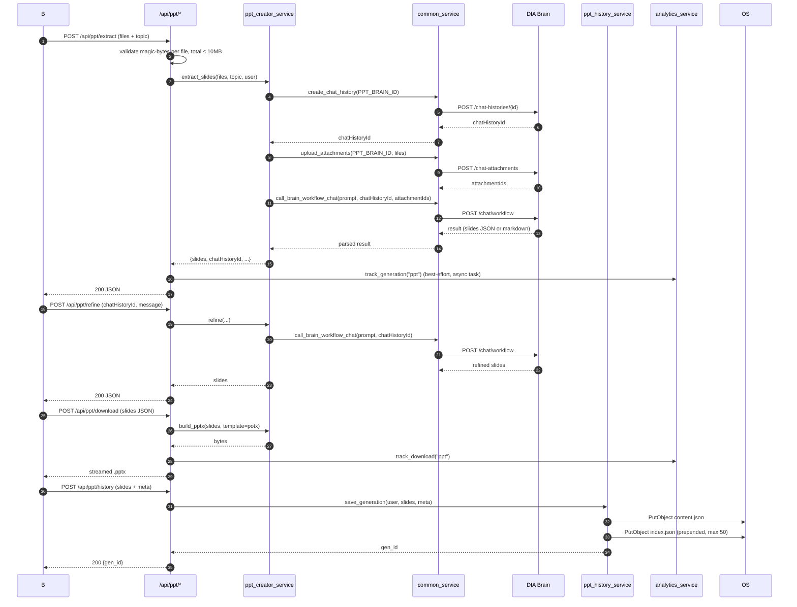
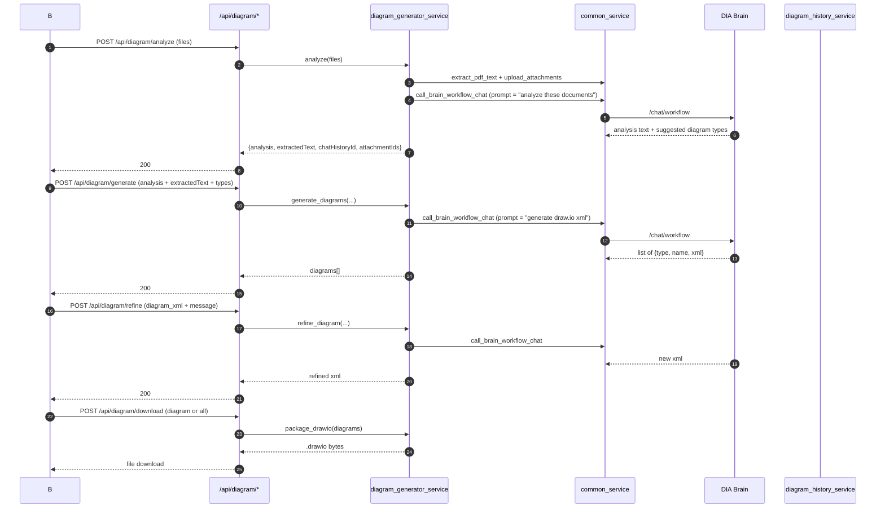
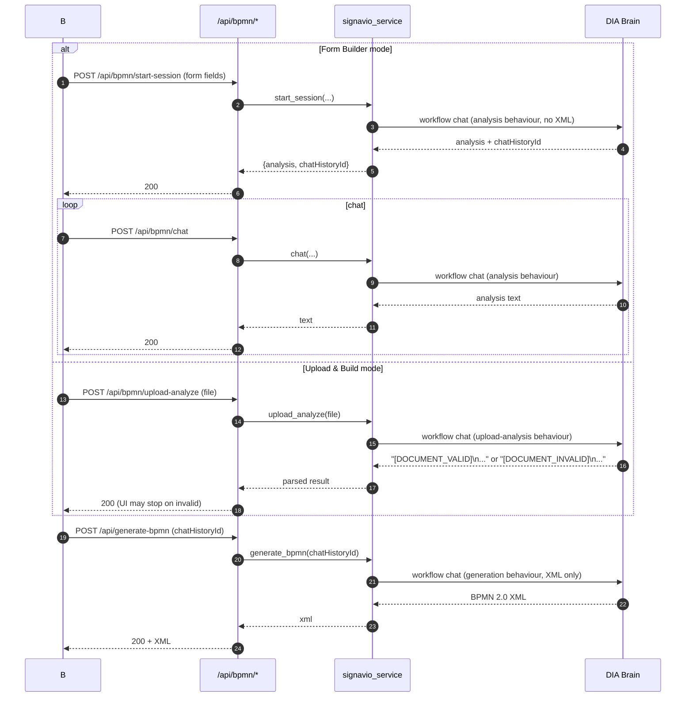
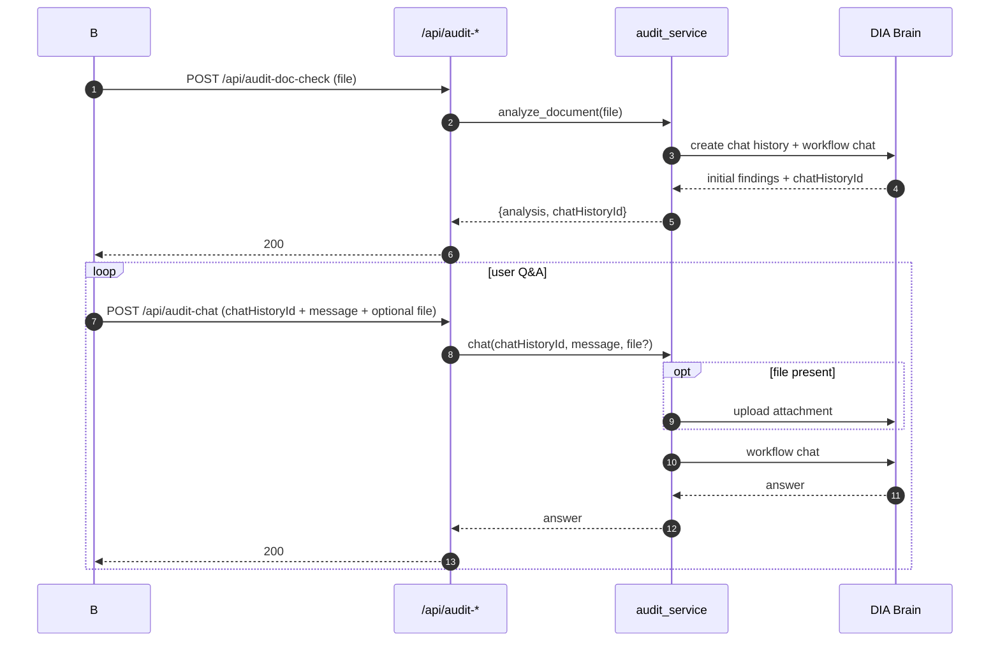
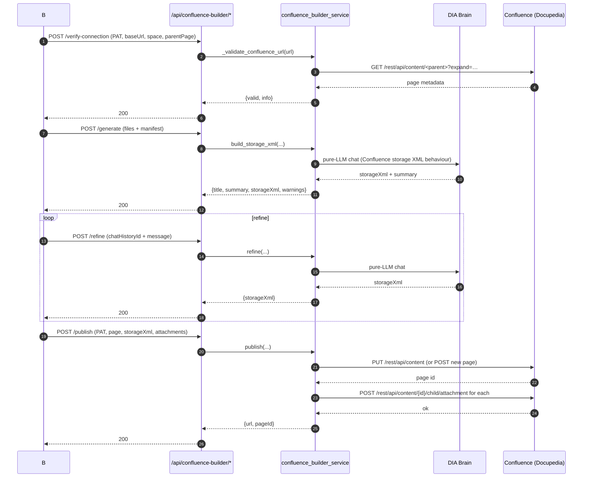
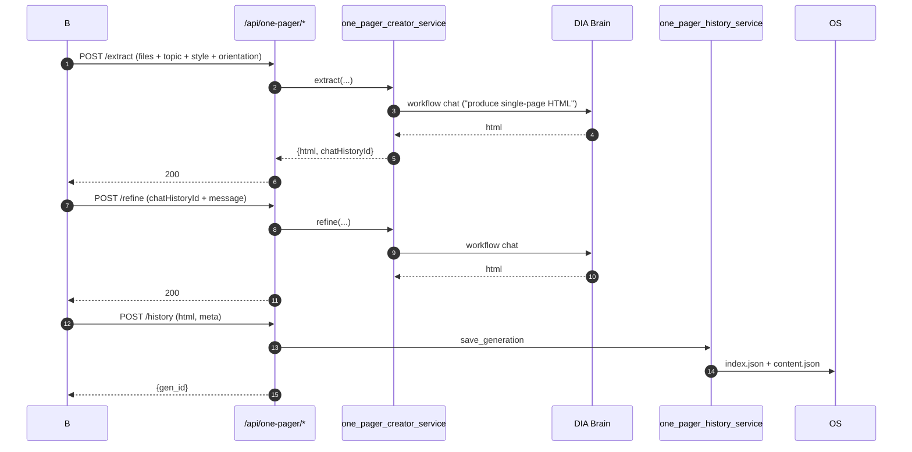
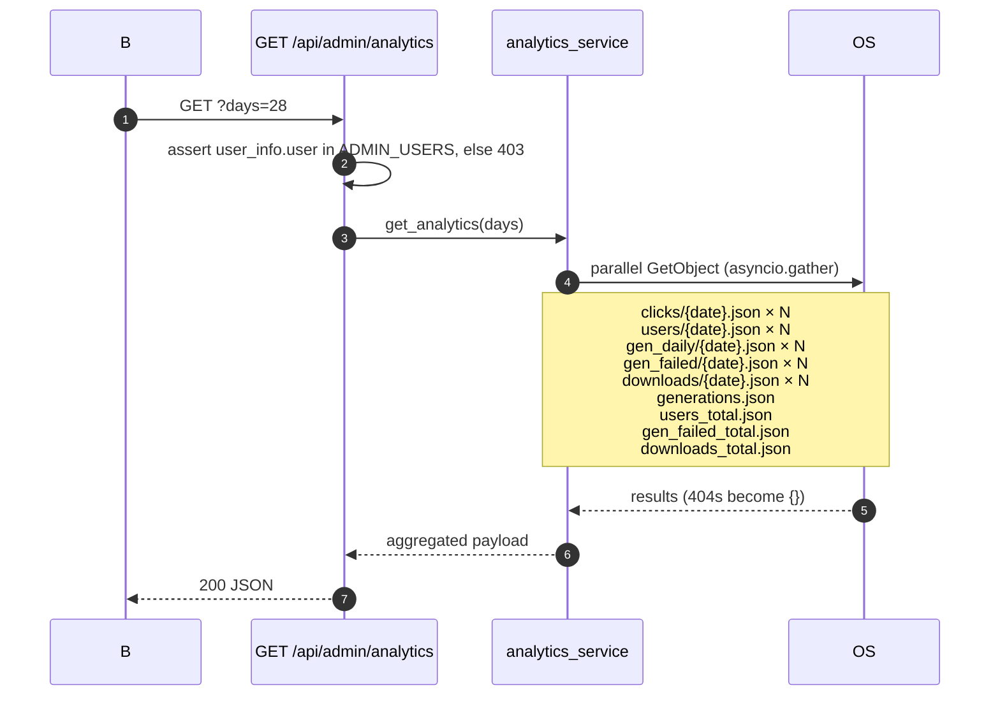

# 05 — Data flows

End-to-end sequence diagrams for every meaningful interaction.

> Convention: **B** = browser, **R** = router (FastAPI route handler), **S** = feature service, **C** = `common_service` (Brain helper layer), **DB** = DIA Brain, **OS** = Object Store, **H** = History service, **A** = analytics service.

---

## 1. PPT Creator — extract → refine → download → save



Key invariants:
* `chatHistoryId` is the same handle from extract → refine → save. Refine calls without it would lose conversation context.
* `track_generation` is fired with `asyncio.create_task` and never blocks the response.
* The history save is explicit (a separate API call) — the user opts in via the UI.

---

## 2. Diagram Generator — analyze → generate → refine → download



The "Copy as Diagram" mode skips analysis and goes straight to `/api/diagram/copy-image` — single image only.

---

## 3. BPMN Builder — two paths into the same brain



The `[DOCUMENT_VALID]` / `[DOCUMENT_INVALID]` first-line tag is a **prompt-engineering contract** between the upload-analysis behaviour and the JS. Don't break it.

---

## 4. Audit Check — analyze + chat with attachments



No history — when the tab closes, the conversation is gone. This is intentional: audit findings are exploratory.

---

## 5. Docupedia Publisher — verify → generate → refine → publish



The PAT travels in `Authorization: Bearer …` only. It is never logged, never persisted to the Object Store, and dropped from memory after the request.

---

## 6. One Pager Creator — extract → refine → save

Same shape as PPT, but the artifact is HTML instead of slides:



---

## 7. Admin analytics fetch



Missing daily files are normal (no activity that day) and are coerced to empty dicts.

---

## 8. Generic generation/download tracking

Every generate-style endpoint follows this pattern:

```python
try:
    result = await service.do_thing(...)
    asyncio.create_task(track_generation(app_key))
    return JSONResponse(...)
except BrainError as e:
    asyncio.create_task(track_generation_failed(app_key))
    return JSONResponse(status_code=mapped_status, content=friendly_error)
```

Every download-style endpoint follows:

```python
asyncio.create_task(track_download(app_key))
return StreamingResponse(...)
```

These three counters (generation, generation-failed, download) are surfaced in the admin dashboard as stacked bars.

---

## 9. Error propagation across layers

```
DIA Brain    →  httpx.HTTPStatusError
                ↓
common_service._friendly_http_error() maps:
  400 → "The request couldn't be processed. Please try again."
  401/403 → "Authentication issue with the AI service."
  404 → "Resource not found."
  413 → "Upload too large."
  429 → "Service is busy. Please retry."
  502/503/504 → "Service temporarily unavailable."
                ↓
service raises BrainError(status, message)
                ↓
router catches BrainError → JSONResponse(status, {message})
                ↓
client common.js Utils.apiRequest → showToast(error)
```

There is **no path** by which `str(exc)` reaches the browser. That's the contract.
