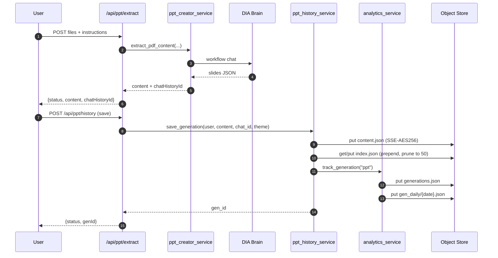

# 06 — Storage & History

> The persistence model for DSCP_AI. There is **no relational database**. Everything is JSON in the BTP **Object Store** (S3-compatible), accessed through `boto3` wrapped in `asyncio.to_thread`.

This page documents the full Object Store layout, every history service, the analytics tracker, the feedback aggregator, the favorites store, and the safety rails (key validation, SSE-AES256, retention, 50-entry trim).

---

## 1. The 30-second mental model

```
BTP Object Store (one bucket: "DSCP_APPS_Object_DB")
│
├── analytics/            ← global counters (read by /dscpadmin)
│   ├── clicks/{date}.json
│   ├── users/{date}.json
│   ├── users_total.json
│   ├── gen_daily/{date}.json
│   ├── gen_failed/{date}.json
│   ├── generations.json
│   ├── gen_failed_total.json
│   ├── downloads/{date}.json
│   └── downloads_total.json
│
├── ppt-history/{user}/index.json + {gen_id}/content.json
├── diagram-history/{user}/...
├── bpmn-history/{user}/...
├── one-pager-history/{user}/...
│
├── favorites/{user}.json
└── feedback/{app_key}/{feedback_id}.json + aggregate/{app_key}.json
```

* **One bucket**, prefix-namespaced.
* **Per-user** history under `{prefix}/{safe_user_id}/`.
* **Global** counters under `analytics/`.
* **All async** I/O via `asyncio.to_thread` around boto3.
* **All best-effort** — no tracking call ever raises.

---

## 2. Storage layer — `app/services/History/storage_service.py`

The boto3 wrapper. **Routers and feature services never touch boto3 directly.**

### 2.1 boto3 client construction

```python
boto3.client(
    "s3",
    region_name=cfg["region"],
    endpoint_url=endpoint,                # https://{host}
    aws_access_key_id=cfg["access_key_id"],
    aws_secret_access_key=cfg["secret_access_key"],
    config=BotoCfg(signature_version="s3v4"),  # SigV4 always
)
```

* **Credentials resolution** (in [app/core/config.py](../app/core/config.py)):
  1. `VCAP_SERVICES.objectstore[0].credentials` — production binding.
  2. Env vars `OBJECT_STORE_HOST/BUCKET/ACCESS_KEY_ID/SECRET_ACCESS_KEY/REGION` — local dev.
  3. **Local dev** with neither: `(None, None)` returned, history silently disabled.
  4. **Production** with neither: `RuntimeError`.
* **Endpoint**: `https://{host}` if scheme missing.
* **Region default**: `eu-central-1`.
* **Server-side encryption**: every `put_object` passes `ServerSideEncryption="AES256"`.

### 2.2 Path-traversal guard

```python
def _validate_key(key: str) -> None:
    if re.search(r"\.\.", key):
        raise ValueError("Key contains '..'")
    if key.startswith("/"):
        raise ValueError("Key cannot start with '/'")
```

Called by every `put_object`, `get_object`, `delete_object`, `list_objects`.

### 2.3 Public API

| Function | Behavior | Failure mode |
|---|---|---|
| `await put_object(key, body, content_type)` | Writes object with `AES256` SSE | Returns `False`, logs ERROR |
| `await get_object(key)` | Returns bytes or `None` | `NoSuchKey` → `None` silently; other errors logged |
| `await delete_object(key)` | Best-effort delete | Returns `False` on error |
| `await list_objects(prefix)` | Returns `list[{"key", "last_modified"}]` (paginated) | Returns `[]` on error |

All wrap boto3 calls in `asyncio.to_thread`. None raise.

---

## 3. History primitive — `common_history.py`

Generic CRUD shared by all four feature history services.

### 3.1 Key shape

```
{prefix}/{safe_user_id}/index.json                 # newest-first list
{prefix}/{safe_user_id}/{gen_id}/content.json      # full payload
```

`safe_user_id` is produced by [`user_id_utils.safe_user_id`](#7-user-id-sanitization-—-user_id_utilspy).

### 3.2 Helpers

```python
def now_iso() -> str            # UTC ISO-8601 with microseconds + tz
def new_gen_id() -> str         # uuid4()
def index_key(prefix, user_id)  -> "{prefix}/{safe}/index.json"
def content_key(prefix, user_id, gen_id) -> "{prefix}/{safe}/{gen_id}/content.json"
```

### 3.3 Public CRUD

| Function | What it does |
|---|---|
| `await get_history(prefix, user_id)` | Returns `list[dict]` from `index.json`, newest first; `[]` on miss/parse error |
| `await get_generation_content(prefix, user_id, gen_id)` | Returns full payload `dict` or `None` |
| `await save_content(prefix, user_id, gen_id, content)` | Writes content blob |
| `await save_index(prefix, user_id, history)` | Writes index list (caller controls ordering) |
| `await append_and_prune(prefix, user_id, gen_id, entry, max_entries=50)` | Prepends entry, trims tail, deletes pruned content blobs in parallel |
| `await delete_generation(prefix, user_id, gen_id)` | Deletes content blob, removes from index, persists |

### 3.4 The 50-entry trim rule

```python
history.insert(0, entry)
if len(history) > max_entries:
    pruned = history[max_entries:]            # tail
    history = history[:max_entries]           # keep
    # delete pruned content blobs in parallel
```

* PPT, Diagram, BPMN: **50 entries** per user.
* One-Pager: **30 entries** per user (HTML payloads are larger).

When the cap is exceeded the **oldest content.json files are deleted** so storage stays bounded; the index is then re-saved with the kept entries only.

---

## 4. Feature history services

All four services are thin façades over `common_history`. They differ only in **prefix**, **entry shape**, and **content shape**.

### 4.1 PPT — `ppt_history_service.py`

* **Prefix**: `ppt-history`
* **Cap**: 50

**Index entry**

```json
{
  "id": "uuid4",
  "title": "Product Strategy",
  "subtitle": "Q2 Overview",
  "slideCount": 12,
  "smartArtCount": 3,
  "chatHistoryId": "…",
  "forceOrangeTheme": true,
  "refinements": 2,
  "createdAt": "2026-04-30T15:23:45.123456+00:00",
  "updatedAt": "2026-04-30T16:10:20.654321+00:00"
}
```

**Content blob**: `{ "title", "subtitle", "slides": [ {layout, content}, … ] }`

**Functions**:
* `save_generation(user_id, content, chat_history_id, force_orange_theme) -> gen_id|None` — counts slides + smart-art layouts, calls `track_generation("ppt")`.
* `update_generation(user_id, gen_id, content) -> bool` — re-counts, increments `refinements`, updates `updatedAt`. **Does not** call `track_generation` (refinement, not new gen).
* `get_history`, `get_generation_content`, `delete_generation` — pass-through to `common_history`.

### 4.2 Diagram — `diagram_history_service.py`

* **Prefix**: `diagram-history`
* **Cap**: 50

**Index entry**

```json
{
  "id": "uuid4",
  "title": "System Architecture",
  "diagramCount": 3,
  "diagramTypes": ["flowchart", "sequence", "class"],
  "chatHistoryId": "…",
  "refinements": 1,
  "createdAt": "…",
  "updatedAt": "…"
}
```

**Content blob**: `{ "title", "diagrams": [ {type, content}, … ] }`

Same function pattern as PPT; `save_generation` tracks `"diagram"`.

### 4.3 BPMN Builder — `bpmn_history_service.py`

* **Prefix**: `bpmn-history`
* **Cap**: 50

**Index entry**

```json
{
  "id": "uuid4",
  "processName": "Order Processing",
  "mode": "form",          // "form" | "upload"
  "hasXml": true,
  "filename": "order_process.bpmn",
  "chatHistoryId": "…",
  "refinements": 0,
  "createdAt": "…",
  "updatedAt": "…"
}
```

**Content blob**: `{ "mode", "formData", "xml", "filename", "chatHistoryId" }` (last four optional).

**Special: rollback on index failure** — if `save_content` succeeds but `save_index` fails, the orphan content blob is deleted to keep storage consistent.

`save_generation` derives `processName` from `formData.processName` → filename (cleaned) → `"Untitled"`.

### 4.4 One Pager — `one_pager_history_service.py`

* **Prefix**: `one-pager-history`
* **Cap**: **30** (HTML payloads up to 500 KB)

**Index entry**

```json
{
  "id": "uuid4",
  "title": "Executive Summary",
  "templateStyle": "modern",
  "orientation": "portrait",
  "chatHistoryId": "…",
  "refinements": 0,
  "createdAt": "…",
  "updatedAt": "…"
}
```

**Content blob**: `{ "title", "templateStyle", "orientation", "chatHistoryId", "html" }`

`update_generation` accepts an optional `title` and merges into both content + index.

### 4.5 What about Audit Check, BPMN Checker, Spec Builder, Docupedia?

They **do not persist history**. Audit/BPMN-Checker are stateless analyses; Spec Builder streams a `.docx` straight back; Docupedia publishes to Confluence. They still call `track_generation` on success and `track_download` when a file is streamed.

---

## 5. Analytics — `analytics_service.py`

Powers `/dscpadmin`.

### 5.1 Constants

```python
APP_LABELS = {
    "ppt":               "PPT Creator",
    "diagram":           "Diagram Generator",
    "bpmn":              "BPMN Builder",
    "audit":             "Audit Check",
    "bpmn-checker":      "BPMN Checker",
    "spec-builder":      "Spec Builder",
    "docupedia":         "Docupedia Publisher",
    "signavio-learning": "Learn Signavio Modeling",
    "one-pager":         "One Pager Creator",
}

ADMIN_USERS = frozenset({"dsd9di", "local-dev", "eim1di", "bsr1di"})
```

`ADMIN_USERS` is the **single source of truth** for the admin gate; it is imported by both [pages.py](../app/routers/pages.py) and [api/admin.py](../app/routers/api/admin.py).

### 5.2 Object Store keys

| Key | Schema |
|---|---|
| `analytics/clicks/{YYYY-MM-DD}.json` | `{app_key: int}` daily page-opens |
| `analytics/users/{YYYY-MM-DD}.json` | `{app_key: [user_id, …]}` daily uniques |
| `analytics/users_total.json` | `{app_key: [user_id, …]}` all-time uniques |
| `analytics/gen_daily/{YYYY-MM-DD}.json` | `{app_key: int}` successful generations today |
| `analytics/gen_failed/{YYYY-MM-DD}.json` | `{app_key: int}` failed generations today |
| `analytics/generations.json` | `{app_key: int}` all-time generations |
| `analytics/gen_failed_total.json` | `{app_key: int}` all-time failures |
| `analytics/downloads/{YYYY-MM-DD}.json` | `{app_key: int}` daily downloads |
| `analytics/downloads_total.json` | `{app_key: int}` all-time downloads |

### 5.3 Track functions (best-effort, never raise)

| Function | Called from | Reads/writes |
|---|---|---|
| `await track_click(app_key, user_id)` | every page route in `pages.py` | `clicks/{date}`, `users/{date}`, `users_total` (parallel `asyncio.gather`) |
| `await track_generation(app_key)` | every history `save_generation` and the stateless service paths | `generations.json` + `gen_daily/{date}` |
| `await track_generation_failed(app_key)` | API handlers in feature endpoints when Brain returns an error | `gen_failed_total` + `gen_failed/{date}` |
| `await track_download(app_key)` | every `*_download` API + spec-builder exports | `downloads_total` + `downloads/{date}` |

All wrapped in `try/except` with `logger.exception(...)`. Never raise.

### 5.4 `await get_analytics(days=28)` → `dict`

```json
{
  "daily_clicks":         {"YYYY-MM-DD": {"ppt": 3, …}, …},
  "daily_unique_users":   {"YYYY-MM-DD": {"ppt": ["u1", "u2"], …}, …},
  "users_total":          {"ppt": ["u1", "u2", …], …},
  "daily_generations":    {"YYYY-MM-DD": {"ppt": 2, …}, …},
  "daily_gen_failed":     {"YYYY-MM-DD": {"ppt": 0, …}, …},
  "daily_downloads":      {"YYYY-MM-DD": {"ppt": 5, …}, …},
  "generations":          {"ppt": 40, …},
  "gen_failed_total":     {"ppt": 1, …},
  "downloads":            {"ppt": 20, …},
  "app_labels":           APP_LABELS,
  "date_range":           ["2026-04-03", …, "2026-04-30"]
}
```

All daily files for the window + all totals are fetched in **one `asyncio.gather`**. Missing/unparseable files become `{}`.

---

## 6. Feedback — `feedback_service.py`

Per-app rating reactions (1–4: Excellent / Good / Okay / Poor).

### 6.1 Constants & keys

```python
_RETENTION_YEARS = 5
_RETENTION_DELTA = timedelta(days=5*365)
```

| Key | Schema |
|---|---|
| `feedback/{app_key}/{feedback_id}.json` | individual record |
| `feedback/aggregate/{app_key}.json` | rolling aggregate |

### 6.2 Record shape

```json
{
  "feedback_id": "uuid4",
  "app_key":     "ppt",
  "gen_id":      "uuid4 | null",
  "rating":      4,
  "created_at":  "2026-04-30T…+00:00"
}
```

### 6.3 Aggregate shape

```json
{
  "total_count": 42,
  "score_sum":   156,
  "scores":      { "1": 2, "2": 5, "3": 10, "4": 25 },
  "last_updated":"2026-04-30T…+00:00"
}
```

### 6.4 Functions

* `await save_feedback(app_key, gen_id, rating) -> bool`
  1. Validates `app_key` ∈ `APP_LABELS`.
  2. Generates `feedback_id` (UUID4), writes record.
  3. Updates aggregate (best-effort).
  4. **Lazy retention**: deletes one expired record per call (`_delete_one_expired`) to gradually reclaim space without batch jobs.
* `await get_all_feedback_aggregates() -> {app_key: aggregate|None}` — used by `/api/admin/feedback`.

---

## 7. Favorites — `favorites_service.py`

Per-user starred apps shown on the homepage.

```python
ALLOWED_APP_KEYS = frozenset({
    "bpmn", "ppt", "diagram", "one-pager",
    "audit-check", "bpmn-checker", "spec-builder",
    "docupedia-publisher", "signavio-learning",
})
_MAX_FAVOURITES = len(ALLOWED_APP_KEYS)  # 9
```

| Key | Schema |
|---|---|
| `favorites/{safe_user_id}.json` | `["ppt", "diagram", "one-pager"]` |

### Functions

* `await get_favorites(user_id) -> list[str]` — filtered against `ALLOWED_APP_KEYS`.
* `await save_favorites(user_id, app_keys) -> bool` — dedup (preserves order via `dict.fromkeys`), filter, truncate to 9.
* `await add_favorite(user_id, app_key)`, `await remove_favorite(user_id, app_key)` — convenience wrappers.

JSON is stored compact (`separators=(",", ":")`).

---

## 8. User-id sanitization — `user_id_utils.py`

```python
def safe_user_id(user_id: Optional[str]) -> str:
    if not user_id: return "anonymous"
    s = re.sub(r"[^a-zA-Z0-9._\-]", "_", user_id)[:64]
    return s or "anonymous"

def validate_user_id(user_id: str) -> str:
    # raises ValueError on empty / >256 chars / contains '..' '/' '\'
```

Examples:
* `"dsd9di"` → `"dsd9di"`
* `"john.doe@bosch.com"` → `"john_doe_bosch_com"`
* `None` → `"anonymous"`

`safe_user_id` is the **only** function allowed to derive S3-key user segments.

---

## 9. Concurrency & error patterns

### Best-effort everywhere
Every persistence function returns `False` / `None` / `[]` instead of raising. The user request never fails because a counter file failed to write.

### Parallelism
* `track_click` / `track_generation` / `get_analytics` use `asyncio.gather(return_exceptions=True)` to fan out to the Object Store.
* `append_and_prune` deletes pruned content blobs without awaiting individually.

### Atomicity
There is **no transactional guarantee**. The mitigations are:
* **BPMN rollback** on index-save failure (see §4.3).
* **gen_id uniqueness** via UUID4 — concurrent saves do not collide.
* **Best-effort** index updates: a failed update never corrupts content blobs.

### gen_id validation
At every API entry, gen_id is regex-validated as UUID v4 by `_validate_gen_id` in [app/routers/api/_shared.py](../app/routers/api/_shared.py). Malformed IDs return **422**.

---

## 10. Lifecycle of a single PPT generation



---

## 11. What is **not** stored

* **Brain `chatHistoryId`** is stored only as a string field in the entry — the actual chat is held by DIA Brain.
* **Generated `.pptx`/`.drawio`/`.docx` binaries** are **never** persisted; they are streamed on demand and rebuilt from the content blob each time.
* **Uploaded files** are sent to Brain and dropped; we never write them to the Object Store.
* **JWTs** are never stored — only the small `user_info` dict goes into the session cookie.

---

## 12. Operational notes

* **Backup**: BTP Object Store keeps versioning if enabled at the bucket level — coordinate with the BTP admin.
* **Migration**: any prefix can be moved en-masse with `aws s3 sync` once you point the CLI at the BTP endpoint and provide the credentials from `VCAP_SERVICES`.
* **GDPR / right to be forgotten**: delete `*-history/{safe_user_id}/`, `favorites/{safe_user_id}.json`, and remove the user from `analytics/users_total.json` and the per-day `analytics/users/*` files. Click counts and `feedback/*` are anonymized.
* **Bucket sprawl**: the 50-entry trim + lazy feedback retention are the only space controls; if you add a new app, mirror the trim rule.

That's the complete persistence story. Continue with [07-api-reference.md](07-api-reference.md) for the HTTP surface that drives all of this.
